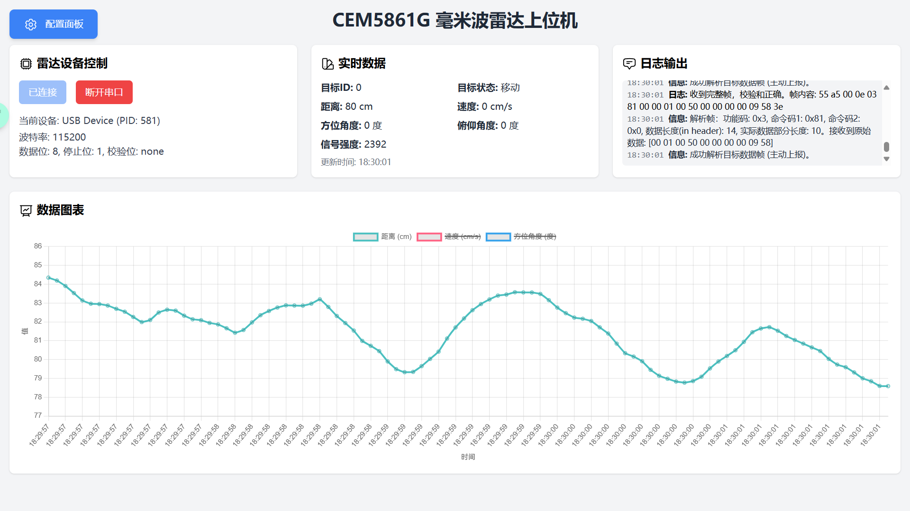
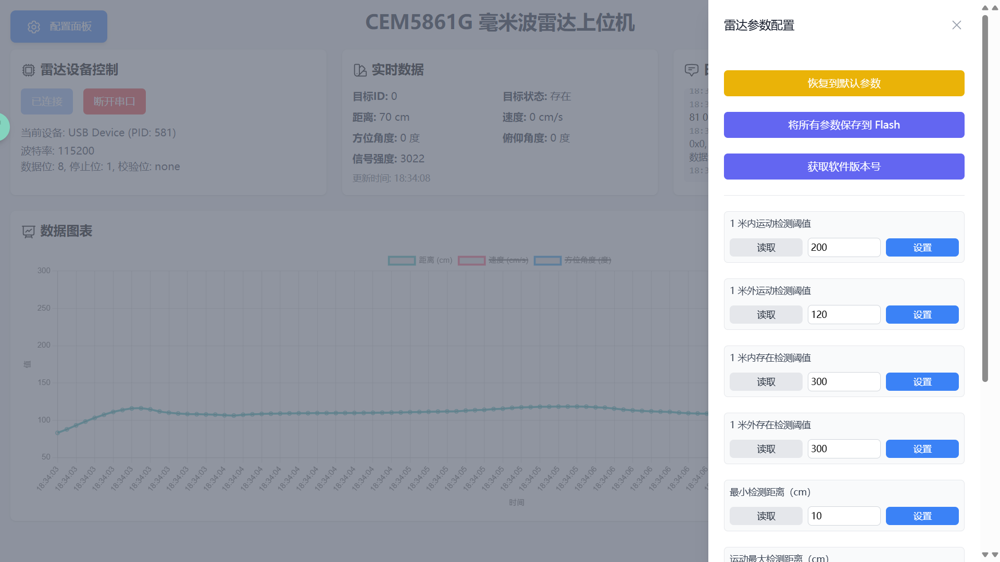

# CEM5861G 毫米波雷达上位机

萤火工场 CEM5861G-M11 24GHz 毫米波雷达模块的上位机软件，使用 Vue3 开发。

## ✨功能特性

- [x] 实时显示雷达数据
- [x] 实时显示距离、速度图表
- [x] 简单易用的配置面板
- [x] ~~由于某种原因兼容矽杰微 RKB1161G~~

|                   主界面                   |                   配置面板                   |
|:---------------------------------------:|:----------------------------------------:|
|  |  |

## 💡如何使用
### 在线使用

https://cem.babyfang.cn/

### 离线使用

下载 Release 中最新版本的压缩包，解压后双击 `index.html` 文件即可。

## 🔧开发指南
### 安装依赖

```bash
npm install
```

### 启动开发服务器

```bash
npm run dev
```

### 打包发布

```bash
npm run build
```
## 📜 开源许可

本项目使用 [Apache License 2.0](https://choosealicense.com/licenses/apache-2.0/) 许可协议开源，你可以自由使用、修改和分发本项目的代码，但需要遵守该协议的条款。
